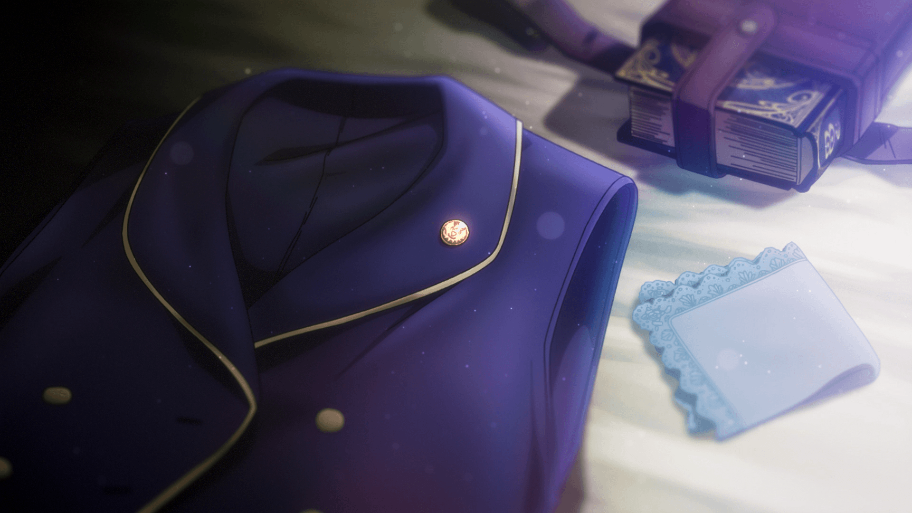
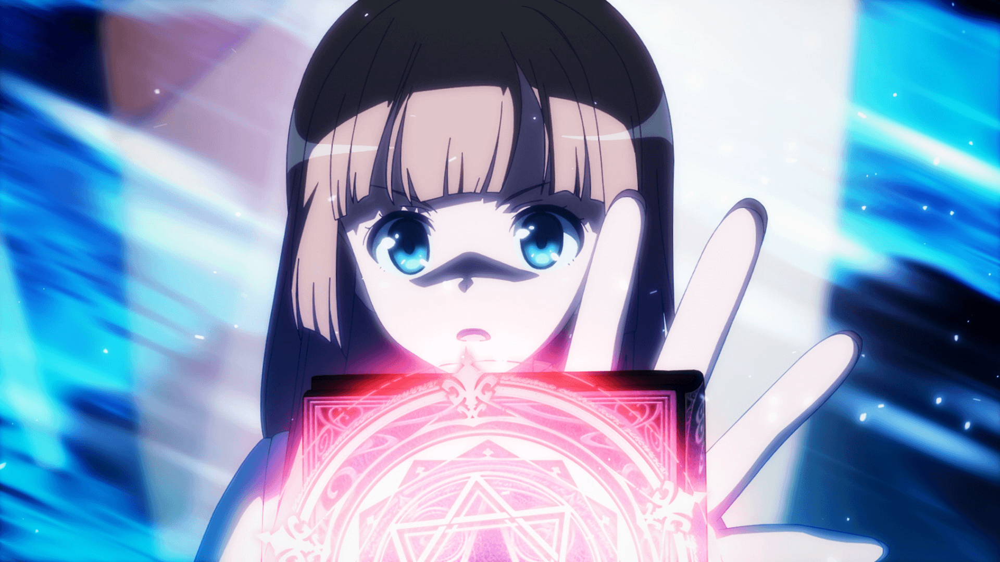
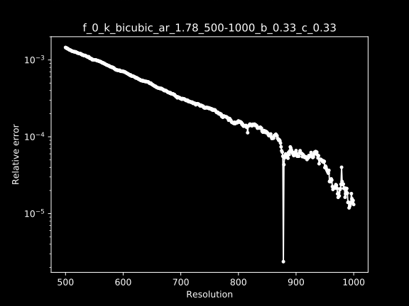
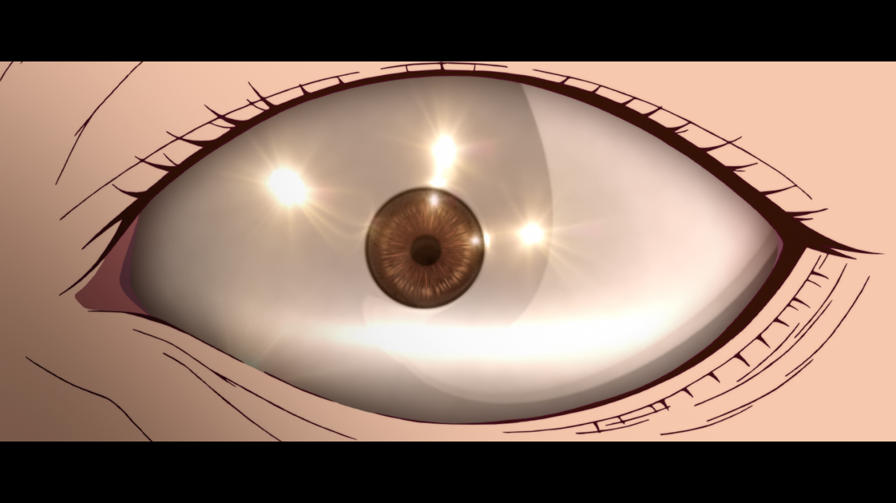
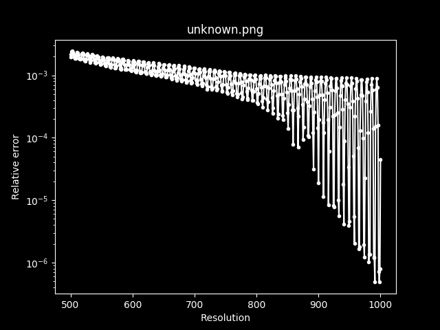
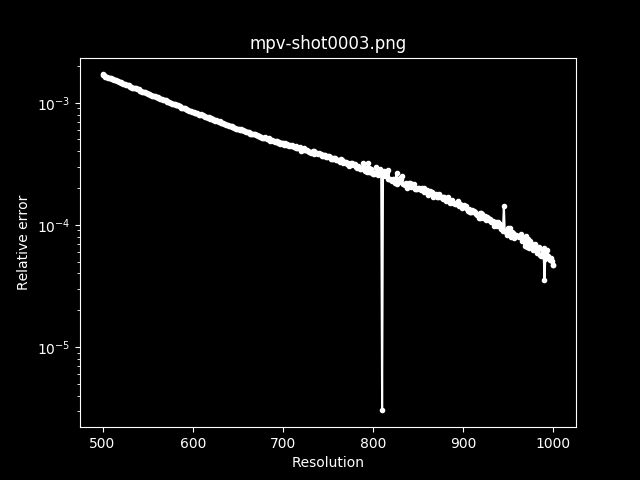
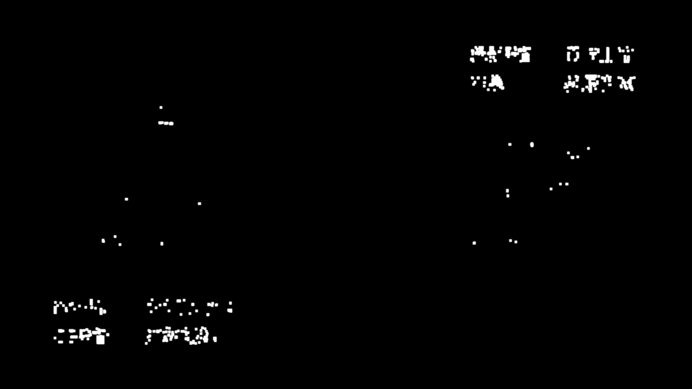
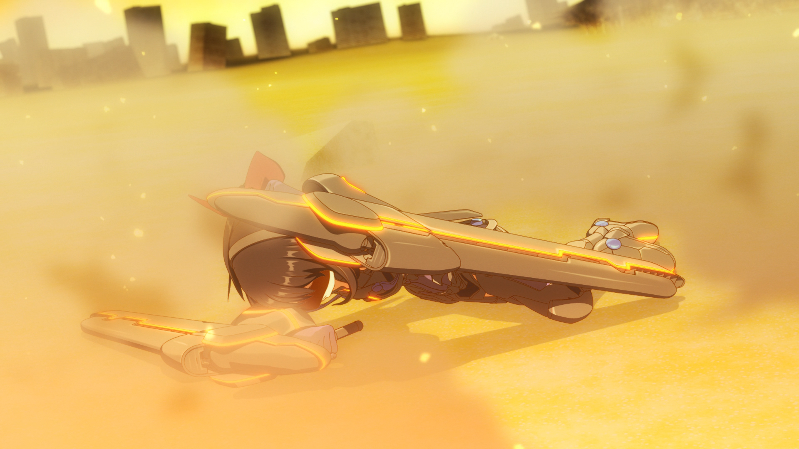

# Descaling

The ability to descale is a wonderful tool
to have in any encoder's arsenal.
You may have heard before that
most anime are not native 1080p,
but a lower resolution.
But how do we make use of that?
How do you find the native resolution
and reverse the upscale?


## When and where to descale

There are many circumstances
where descaling might prove beneficial.
For example,
say you've got
a very blurry Blu-ray source.
Rather than sharpening it,
you might want to consider
checking if it's possible to descale it
and maybe alleviate a lot of
the blur that way.
Or the opposite:
say you've got a source full of ringing.
It might have been upscaled
using a very sharp kernel,
so it's worth a try
to see if it can be descaled.
It's no surprise that descaling tends to
offer far better lineart
than usual rescaling does.

However, descaling is not always an option.
The worse your source is,
the less likely it is that
descaling will yield better results
than a simple resample.
If you've got a source
full of broken gradients
or noise patterns,
like your average simulcast stream,
descaling might only hurt the overall quality.
Sadly, sources with a lot of post-processing
might also prove tough to properly descale
without dabbling with specific masks.
However, as long as you've got
a source with nice, clean lineart,
descaling might be a viable option,
and possibly nullify the need
for a lot of other filtering.


## Preparation

To prepare for figuring out the native resolution,
you'll want to use [getnative][],
a Python script designed for
figuring out the resolution
a show was animated at.
For the actual descaling,
make sure to grab BluBb-mADe's [descale][].

One important thing
to keep in mind when descaling
is that you will never find
"the perfect descaling settings".
Even if you find the exact settings
that the studio used,
you won't be able to get a frame-perfect replica
of the original frame.
This is because the best available sources to consumers,
usually Blu-rays,
aren't lossless.
There are always going to be some differences
from the original masters
which makes it impossible
to perfectly descale something.
However, usually those differences
are so small that they're negligible.
If you run into a case where
you can't find any low relative error spikes,
resizing can be highly destructive.
It's instead recommended to resize
as you would normally,
or to not mess with scaling at all.

[getnative]: https://github.com/Infiziert90/getnative
[descale]: https://github.com/BluBb-mADe/vapoursynth-descale


## Finding out the native resolution

To figure out what
the native resolution of an anime is,
first you need a good frame to test.
Ideally,
you'll want a bright frame
with as little blur as possible of high quality
(Blu-ray or very good webstreams).
It also helps to not have
too many post-processed elements in the picture.
Whilst it is most definitely possible
to get pretty good results with "bad" frames,
it's generally better to use
good frames whenever possible.

Here are some examples of "bad" frames.



This picture is dark.
It also has some effects over it.



This picture is also very dark
and has even more effects over it.


Heavy dynamic grain will almost always give bad results.


This is a nice frame to use as reference.
The background is a bit blurry,
but it isn't full of effects
and is fairly bright.
The lineart is very clear.

We will now make use of the getnative.py script
to figure out what resolution
this anime was produced at.
Run the following in your terminal:

```bash
$ python getnative.py "descale_manaria04.png"
```

It should show the following:

```
Using imwri as source filter
501/501
Kernel: bicubic AR: 1.78 B: 0.33 C: 0.33
Native resolution(s) (best guess): 878p
done in 18.39s
```

If you check the directory
where you executed the script,
you will find a new folder
called "getnative".
You can find the following graph
in there as well:




The X-axis shows the resolutions that were checked,
and the Y-axis shows the relative error.
The relative error refers to
the difference between the original frame
and the rescaled frame.
What you're looking for are
the spikes that show a low relative error.
In this case it very clearly points to 878p.

As a sidenote,
it's important to keep in mind that this script
can't find native 1080p elements.
This is because it descales the frame
and reupscales it afterwards
to determine the relative error.
You can't descale to 1080p
if the frame is already 1080p.
If you have reason to believe
that your show might be native 1080p,
you've got to go with your gut.


An example of a graph for a native 1080p show.

You may notice that the line swerves a bit
in the first graph.
There are going to be cases where
you will get odd graphs like these,
so it's important to know
when the results are safe enough to descale
or when they're too risky.
Here is an example of
a "bad" graph:


```
Output:
Kernel: bicubic AR: 1.78 B: 0.33 C: 0.33
Native resolution(s) (best guess): 869p, 848p
```

The script has determined that
it's likely either 848p
or 869p.
However,
there are no clear spikes in this graph
like there was in the Manaria Friends one.
The results are not clear enough
to work off of.
Here's another example:


```
Output:
Kernel: bicubic AR: 1.78 B: 0.33 C: 0.33
Native resolution(s) (best guess): 1000p, 974p, 810p
```

This graph has a lot of unnatural swerves
and it's impossible to determine
what the native resolution is.

Another pitfall you've got
to watch out for
is checking the results of a frame
with letterboxing.





You will have to crop them beforehand
or they will return odd graphs like this.

For a change of pace,
let's look at a good graph.



```
Output:
Kernel: bicubic AR: 1.78 B: 0.33 C: 0.33
Native resolution(s) (best guess): 810p
```
The results are very clear.
There are a couple of deviations,
but there's a very clear spike
going down to 810p.
This is a good result
for testing out varying kernels.


## Descaling

Now it's time to actually start descaling.
Open up your VapourSynth editor of choice,
and import the clip:

```Py
src = core.lsmas.LWLibavSource("BDMV/[BDMV][190302][マナリアフレンズ I]/BD/BDMV/STREAM/00007.m2ts")
```

The next issue is figuring out
what was used to [upscale](resampling.md#upsampling) the show.
By default,
getnative.py checks with Mitchell-Netravali
(bicubic b=1/3, c=1/3).
However, it might have also been upscaled
using other kernels.

Here is a list
of some common kernels and values.

* Lanczos
* Spline16
* Spline36
* Bilinear
* Bicubic b=1, c=0 (B-Spline)
* Bicubic b=0, c=0 (Hermite)
* Bicubic b=1/3, c=1/3 (Mitchell-Netravali)
* Bicubic b=0, c=0.5 (Catmull-Rom)
* Bicubic b=0, c=1 (Sharp Bicubic)

The best way to figure out
what is used is to simply try out
a bunch of different kernels
and use your eyes.
Check for common scaling-related artifacting,
like haloing, ringing, aliasing, etc.

For bicubic,
it is important
to keep in mind that
you will typically find that
the values match the following mathmatical expressions:

* `b + 2c = 1`
* `b = 0, c = X`
* `b = 1, c = 0`

Whilst this isn't a 100% guarantee,
it is the most common approach
to rescaling using bicubic,
so it's worth keeping in mind.

Here's an example of the previous frame
when descaled using various kernels and settings
(note that descale requires either GrayS, RGBS, or YUV444PS.
I'll be using `split` and `join` from `kagefunc` to split the planes
and then join them again in this example,
and `get_w` from `vsutil` to calculate the width)[^1]:

[Comparison between frames][manaria_compare]

```Py
from vapoursynth import core
import vsutil
import kagefunc as kgf
import fvsfunc as fvf

src = core.lsmas.LWLibavSource("BDMV/[BDMV][190302][マナリアフレンズ I]/BD/BDMV/STREAM/00007.m2ts")
src = fvf.Depth(src, 32)

y, u, v = kgf.split(src)
height = 878
width = vsutil.get_w(height)

# Bilinear
descale_a = core.descale.Debilinear(y, width, height).resize.Bilinear(1920, 1080)
descale_a = kgf.join([descale_a, u, v])
# Mitchell-Netravali
descale_b = core.descale.Debicubic(y, width, height, b=1/3, c=1/3).resize.Bicubic(1920, 1080, filter_param_a=1/3, filter_param_b=1/3)
descale_b = kgf.join([descale_b, u, v])
# Sharp Bicubic
descale_c = core.descale.Debicubic(y, width, height, b=0, c=1).resize.Bicubic(1920, 1080, filter_param_a=0, filter_param_b=1)
descale_c = kgf.join([descale_c, u, v])
# B-Spline
descale_d = core.descale.Debicubic(y, width, height, b=1, c=0).resize.Bicubic(1920, 1080, filter_param_a=1, filter_param_b=0)
descale_d = kgf.join([descale_d, u, v])
# Catmull-rom
descale_e = core.descale.Debicubic(y, width, height, b=0, c=1/2).resize.Bicubic(1920, 1080, filter_param_a=0, filter_param_b=1/2)
descale_e = kgf.join([descale_e, u, v])
# Spline36
descale_f = core.descale.Despline36(y, width, height).resize.Spline36(1920, 1080)
descale_f = kgf.join([descale_f, u, v])
```

You might realize that after descaling,
we are immediately upscaling the frame
with the same kernel and values again.
This is done so we can compare the before and after.
The closer the new frame is to the old one,
the more likely it is that you've got the correct kernel.
Zooming in on the frame at 4x magnification or higher
using nearest neighbor
will help immensely.
An alternative that you can use
is to simply descale until
you've got what you believe to be the best result.
It's faster to do it this way,
but might be less accurate.

[manaria_compare]: https://slowpics.org/comparison/61e39e1e-d074-4d83-b7c9-b0f4e1861855


## Credits and other native 1080p elements

There is one very, very important thing
to keep in mind when descaling:

*Credits are usually done in 1080p*.

There are various masks you can use
to help with dealing with that issue,
but it might be better
to make use of existing wrappers instead.
For this example I'll
be using `inverse_scale` from `kagefunc`.

```Py
descaled = kgf.inverse_scale(src, height=878, kernel='bicubic', b=0, c=1/2, mask_detail=True)
```

We can make use of the mask
that `inverse_scale` uses internally
as well.

```Py
descaled = kgf.inverse_scale(src, height=874, kernel='bicubic', b=0, c=1/2)
descaled_mask = kgf._generate_descale_mask(vsutil.get_y(core.resize.Spline36(src, descaled.width, descaled.height)), vsutil.get_y(descaled), kernel='bicubic', b=0, c=1/2)
```




Note that if you see the mask
catching a lot of other stuff,
you might want to consider *not* descaling
that particular frame,
or trying a different kernel/values.
Chances are that you're either
using the wrong kernel
or that the frames you're looking at are native 1080p.


## Dealing with bad descaling

There are various things you can do
to deal with scenes that have issues
even after descaling.
`Eedi3` stands out in particular
as a fantastic AA filter
that really nails down bad lineart
caused by bad descaling.
It's at best a "cheat code",
however.
While it might fix up some issues,
it won't fix everything.
It's also incredibly slow,
so you might want to
[use it on just a couple of frames at a time](scenefiltering.md)
rather than over the entire clip.

Other than Eedi3,
usually the results of bad descaling
are so destructive that
there isn't much you can do.
If you have an encode that's
badly descaled,
you're better off
finding a different one.
If you've got bad results
after descaling yourself,
try a different kernel or values.
Alternatively,
try not descaling at all.

At the end of the day,
as mentioned in the introduction,
you can't descale everything perfectly.
Sometimes it's better to think of it
as a magical anti-ringing/haloing/aliasing filter
rather than a scaler.

For example,
here it was used
specifically to fix up
some bad aliasing
in the source.




```py
scaled = kgf.inverse_scale(src, height=900, kernel='bicubic', b=0.25, c=0.45, mask_detail=True)
scaled = nnedi3_rpow2(scaled).resize.Spline36(1920, 1080)
```

Note how this fixed
most of the aliasing
on the CGI model.

***

[^1]: Most, if not all, relevant VapourSynth scripts/plug-ins and their functions can be found in the [VapourSynth Database][vsdb].

[vsdb]: http://vsdb.top/
