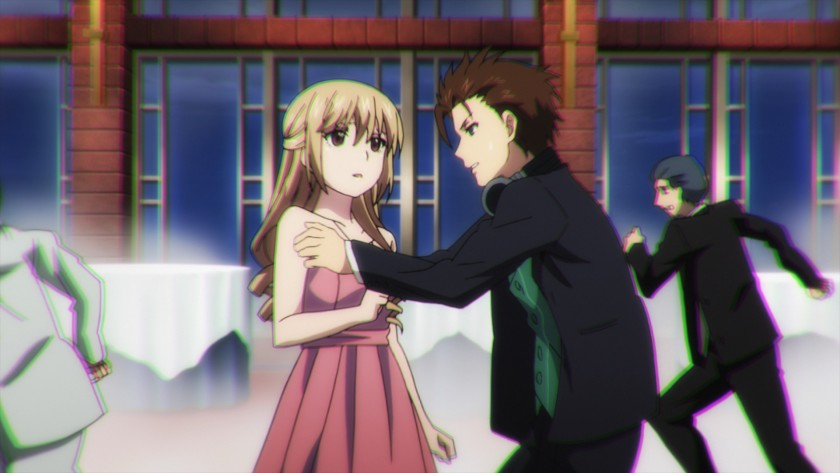

# Recognizing Video Artifacts

The term "artifact" is used to broadly describe defects or foreign,
unwanted elements in a video.
There can be any number of causes ranging from lossy compression,
improper conversions,
to post-processing adjustments like sharpening and resampling.
This guide will go over how to identify different types of artifacts,
how they occur,
and some steps to remove them wherever possible.

Before we dive into this laundry list of problems
with no clear solutions,
let’s start by recognizing some things
that often get mistaken for artifacts.

## Not Artifacts

### Grain

Aside from film grain,
grain is added to videos for a few different reasons.
It can be added by the studio to create an effect/change the atmosphere,
or it can be added by the disc author/encoder
to protect against more harmful artifacts from occurring after encoding
(mostly banding and blocking).
In excess,
it may be considered an artifact,
but to us anime encoders of the 21st century
it is not an artifact,
nor is it something we should be expected to remove.

However, it is often mistaken for "noise",
and for anime and lossy compression,
these two things may sometimes be indistinguishable,
but the two differ at a fundamental level;
grain being added at the discretion of a human being[^1],
and noise being added by lossy compression.
See [Noise section](#Noise) for more information on the subject.

### Badly drawn line art

Bad lines happen,
but its hard to say whether it's worth it to try to fix it.
Using awarpsharp or sangnom to fix it will surely lead to disaster.

### Chromatic Aberration

### …and please don't do this

## Artifacts

### Blocking

DCT block based video compression has come a long way.
If you happen to be encoding an MPEG2 TV station
or a DVD from a previous decade,
you will likely come across something like this:

\(Urban, 2017\)

From Biamp's Blog[^2]:
"Blocking is known by several names – including tiling,
jaggies,
mosaicing,
pixelating,
quilting,
and checkerboarding –
and it occurs whenever a complex (compressed) image
is streamed over a low bandwidth connection
(imagine a golf ball being passed through a garden hose).
At decompression,
the output of certain decoded blocks makes surrounding pixels
appear averaged together to look like larger blocks."\(Urban, 2017\)

Thankfully most blocking in BDs and web streams nowadays isn’t
nearly as bad,
and can either be ignored or removed
by another stage in your filter chain[^3].
Denoising,
debanding,
and adding grain will all help to reduce blocking.

### Noise

As stated earlier,
noise and grain are often used interchangeably.
Visually, noise looks uglier and more out of place than grain.
It's less defined and can look blotchy,
blocky,
or be made up of small dots,
whereas grain looks like a proper texture.

In some cases,
heavy random grain may be added and then encoded with a low bitrate,
resulting in large,
noisy,
blocky,
unstable grain in the video.
This is often impossible to remove without noticeable detail loss,
and in this case scenefiltering and heavy detail loss
are the only two options.

### Banding

Due to with its many flat areas and smooth gradients,
banding is a frequent problem in anime,
which is caused by caused by the limits of 8-bit color depth
and (especially in low bitrate sources) truncation.
The filter GradFun3 is the most common tool for removing it,
and is the right tool for the job in average cases.

Some other options are available if this isn’t enough:
Particularly large quantization errors,
worse banding in dark scenes,
and/or banding with grain are cases where
experimenting with a few masking/limiting techniques
or scene-filtering may be the best option.

### Aliasing

Aliasing has a few main causes:
interlacing,
low bitrate encoding,
shitty sharpening,
and shitty upscaling
(the latter two are often accompanied by ringing).

In the case of resizing,
the descale plugin with the right settings
may be enough to alleviate the aliasing,
but bear in mind that the poorer your source video is,
the less effective it will be.

In other cases,
an edge directed interpolation filter,
normally used for deinterlacing,
is used to smooth the edges.
These include nnedi3,
eedi3,
EEDI2,
~~and sangnom2~~.
The process involves supersampling and
(re-)interpolating lines in an attempt to minimize detail loss and
maximize continuity.
Masking is very common,
and is always recommended.

There are one or two other methods,
the most common of which is a filter called daa.
It's sometimes used,
but outside of bad interlacing-related aliasing,
it is rarely recommendable.

### Ringing

Ringing is something of a blanket term for edge artifacts,
including mosquito noise,
edge enhancement artifacts,
overshoot,
or actual ring-like ringing caused by the Gibbs phenomenon.

\(Urban, 2017\)

In Blu-ray encodes,
the only ringing you’ll be likely to see is
upscaling methods such as Lanczos and sharp Bicubic variants,
or possibly from badly done sharpening.
This is because ringing is primarily a compression artifact,
and BDs are generally high bitrate,
and even bad BDs don’t tend to ring much.

Thus, you are much more likely to see ringing in low bitrate webrips
and MPEG2 TV captures.
Despite it being a vastly inferior codec,
ringing in MPEG2 sources is actually much easier to deal with than the
stubborn ringing in H.264 encodes.
In these cases,
a simple smoothing based edge-scrubber like HQDeringmod,
or a warpsharp-based scrubber *similar to* EdgeCleaner
it has a shitty mask) should all work just fine
without too many drawbacks.

In the case of heavily compressed H.264 sources,
consider doing a manual masking/limiting/filtering,
or scenefiltering with some of HQDeringmod’s safety-checks disabled
(change repair from default 24 to 23,
or disable entirely)

### Haloing

Another edge artifact,
this time much cleaner and easier to spot.
Halos (especially in anime) are exactly as their title would imply;
an even,
thick,
brightness surrounding lines.
In some cases they might even seem like they’re supposed to be there.
In Blu-rays this is rarely a problem,
but if you do come across it,
a masked dehalo\_alpha filter such as Fine\_Dehalo
or a manual filtering of dehalo\_alpha with dhhmask
(zzfunc.py coming soon™) are recommendable.

### Cross-Field

Noise

---

[^1]: At least, in digital anime. Actual grain is different but you most likely aren't encoding shows from the 90s so who cares.

[^2]: Urban, J. (2017, February 16). Understanding Video Compression Artifacts. Retrieved from http://blog.biamp.com/understanding-video-compression-artifacts/

[^3]: Blocking may also occur for other reasons other than compression data loss. [Image re-construction with padding][waifu2x238] can cause very similar looking effects, although this is irrelevant for fansubbing source videos.

[waifu2x238]: https://github.com/nagadomi/waifu2x/issues/238
